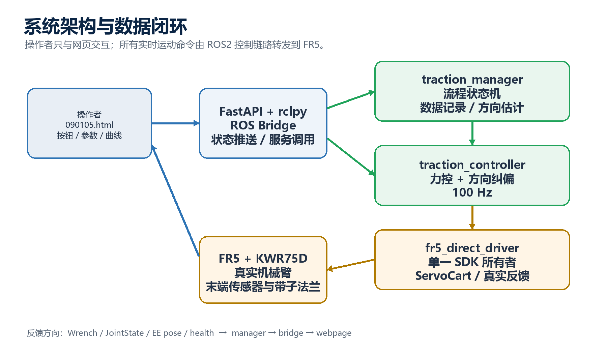
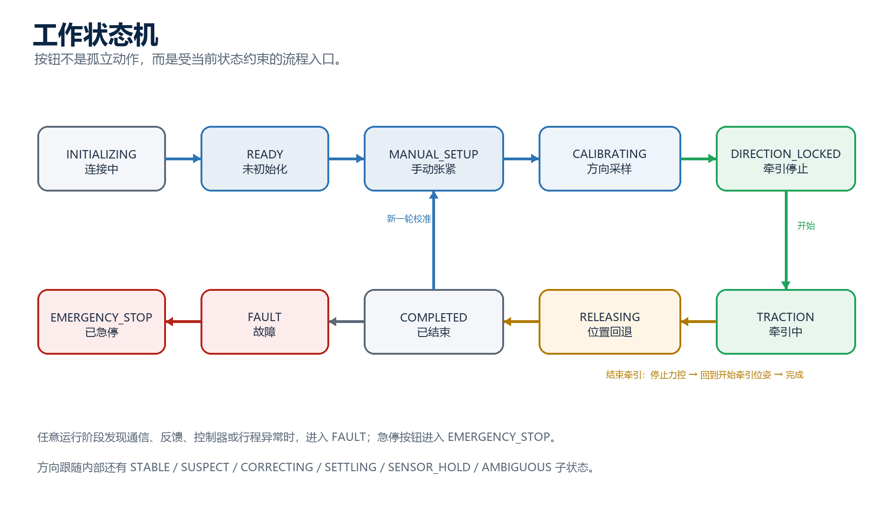
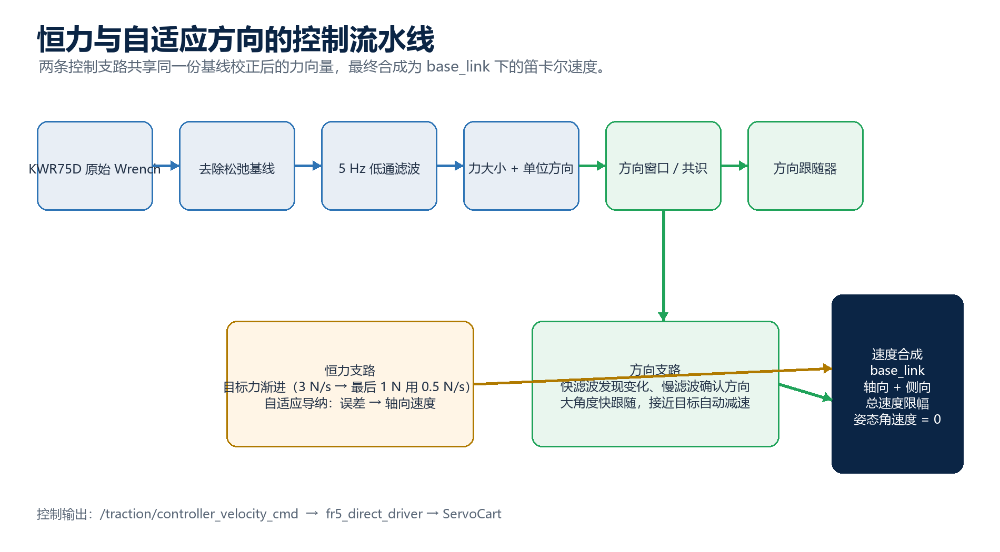
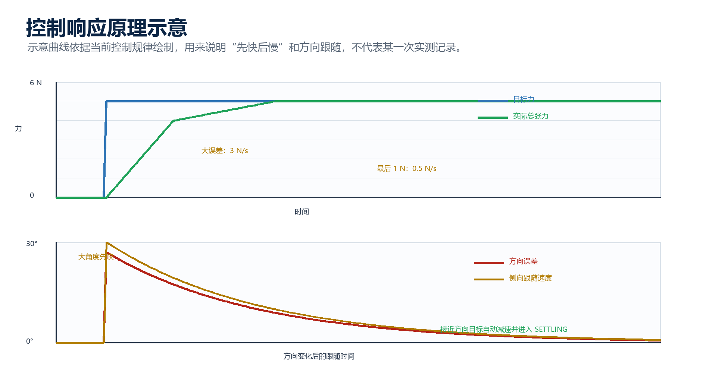
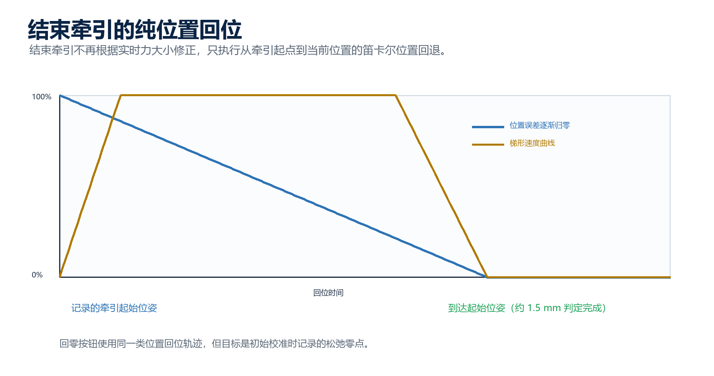
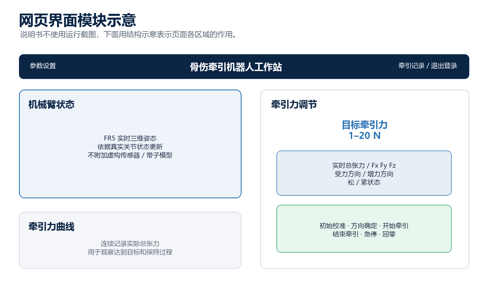

# FR5 骨伤牵引机器人工作站项目说明书

**当前版本：恒力牵引 + 实时自适应方向跟随**  
本文面向项目使用、维护、后续算法研究与论文写作，描述当前已经完成并投入工作站的这一版实现。

> 核心结论：系统以 KWR75D 力传感器测得的三轴力向量为唯一控制依据，在 base_link 坐标系下同时完成“总张力保持”和“方向变化跟随”。方向发生明显变化时，系统先确认新方向，再进行侧向移动，最后恢复恒力控制；小幅抖动通过滤波、鲁棒窗口和滞回被抑制。

## 目录

- [1. 项目概述](#1-项目概述)
- [2. 系统组成](#2-系统组成)
- [3. 工作流程与状态机](#3-工作流程与状态机)
- [4. 软件结构与通信接口](#4-软件结构与通信接口)
- [5. 算法原理](#5-算法原理)
- [6. 网页界面与操作说明](#6-网页界面与操作说明)
- [7. 数据记录、导出与复现](#7-数据记录导出与复现)
- [8. 运行、配置与维护](#8-运行配置与维护)
- [9. 技术验证要点](#9-技术验证要点)
- [附录 A：术语表](#附录-a术语表)
- [附录 B：版本范围与简要演进](#附录-b版本范围与简要演进)

## 1. 项目概述

### 1.1 项目目标

本项目建立了一套基于真实法奥 FR5 机械臂的骨伤牵引机器人工作站。机械臂末端安装 KWR75D 力传感器和带子法兰，带子另一端连接可被人员手动改变方向的测试目标。工作站通过网页完成牵引流程管理，通过 ROS2 完成实时测力、力控、方向估计、侧向纠偏、状态管理和数据记录。

当前版本的两个核心能力如下：

- 恒力牵引：按照网页设定的目标值保持绳中总张力，例如 5 N、10 N 或 20 N。目标力变化时不做突变，而是先快后慢地接近目标。
- 自适应方向跟随：牵引过程中，人员可以改变手中目标的方向。系统不把方向锁定为永远不变，而是从实时三轴力中识别新的稳定方向，过滤小幅噪声，再驱动机械臂沿侧向跟随，完成后继续恒力牵引。

### 1.2 典型使用场景

一次典型操作可以理解为“先找到绳子该往哪里拉，再按照目标力持续拉；如果人改变了方向，机器人跟过去”。具体过程是：

1. 机械臂处于松弛零点，完成初始校准。
2. 操作者使用法奥官方示教器手动移动机械臂，只做 X、Y、Z 平移，保持法兰方向不变，直到绳子张紧。
3. 在张紧且法兰保持静止时点击方向确定，系统采样并锁定初始牵引方向。
4. 输入目标牵引力并开始牵引，系统使用三轴力向量闭环控制。
5. 人员在牵引过程中改变目标方向；系统经过稳定性判断后，沿新方向侧向移动，再恢复恒力。
6. 点击结束牵引，系统停止力控，按位置回到开始牵引时的位姿；点击回零则回到初始校准时记录的松弛零点。

### 1.3 项目边界与工程选择

当前版本直接面向真实 FR5 和真实 KWR75D，不使用 Gazebo、Ignition、仿真机械臂、假数据或数字孪生。网页中的机械臂三维显示使用真实关节状态更新，用于表达“当前机械臂长什么样”，不把传感器、带子或法兰末端做成虚构模型。

系统采用单一真实机器人 SDK 所有者：fr5_direct_driver 负责与法奥 SDK 通信，网页和其他节点不能绕过 ROS2 直接抢占机器人 SDK。这种结构既保持接口清晰，也避免多个程序同时控制一台 FR5。

图 1  系统架构与数据闭环

## 2. 系统组成

### 2.1 硬件组成

| 组成 | 当前配置 | 作用 |
|---|---|---|
| 机器人本体 | 法奥 FR5 | 提供末端位置、关节状态和笛卡尔速度执行能力 |
| 力传感器 | KWR75D | 输出三轴力分量，作为松紧判断、方向估计和恒力控制输入 |
| 末端工具 | 力传感器 + 带子法兰 | 连接牵引带；当前没有夹爪 |
| 牵引目标 | 可被人员手动改变方向的目标 | 在实际操作中产生方向变化和外力扰动 |
| 控制计算机 | WSL2 Ubuntu + ROS2 Humble | 运行 ROS2 控制栈、FastAPI 网页服务和数据记录 |

### 2.2 坐标系和物理量

系统统一在 base_link 坐标系表达和控制三轴力、牵引方向、增力方向、末端位置与侧向速度。内部长度单位为 m，角度单位为 rad，向量分量使用 double；网页展示时转换为 mm、degree 或 N。

设去除松弛基线后的力向量为：

F = [F_x, F_y, F_z]^T。

它的模长是绳中总张力的估计值：

T = ||F|| = √(F_x² + F_y² + F_z²)。

当 T 大于方向有效阈值时，单位受力方向为：

u = F / ||F||。

因此网页上显示的 Fx、Fy、Fz 是三个分量，实时总张力是三轴合成后的模长，受力方向是 u，而不是某一根坐标轴的正负号。

### 2.3 运行时数据链路

网页不直接读取机器人 SDK，而是通过 FastAPI 的 ROS Bridge 访问 ROS2。ROS2 中的主要链路为：

- KWR75D 原始力数据由真实驱动节点发布到 /controller_manager/wrench。
- traction_manager 完成基线、方向锁定、方向跟踪、状态机和牵引记录。
- traction_controller 以 100 Hz 计算力控速度和方向纠偏速度。
- fr5_direct_driver 将最终笛卡尔速度发给 FR5，并返回真实位姿、关节、健康状态和力数据。
- ROS Bridge 将状态整理成网页快照，并通过 WebSocket 推送给 090105.html。

### 2.4 当前版本输出

当前版本对外提供的主要结果包括：

- 机械臂真实三维状态。
- 实时 Fx、Fy、Fz 和总张力。
- 受力方向、增力方向、方向跟踪状态。
- 松弛 / 张紧状态。
- 牵引力曲线。
- 单次牵引的完整时序记录、操作记录和摘要导出。

## 3. 工作流程与状态机

图 2  工作状态机

### 3.1 状态含义

| 状态 | 页面显示 | 含义 |
|---|---|---|
| INITIALIZING | 连接中 | 正在等待真实 ROS2、FR5 和力传感器数据 |
| READY | 未初始化 | 系统已连通，但本次操作还没有建立松弛零点 |
| MANUAL_SETUP | 未初始化 | 已完成初始校准，等待操作者用示教器手动张紧 |
| CALIBRATING | 未初始化 | 正在采集一段静止张紧数据，估计初始方向 |
| DIRECTION_LOCKED | 牵引停止 | 初始方向有效，等待输入目标力并开始牵引 |
| TRACTION | 牵引中 | 同时运行总张力控制和方向自适应跟随 |
| RELEASING | 正在结束 | 停止力控，按位置回到牵引开始位姿 |
| COMPLETED | 牵引停止 | 本次牵引已经结束，历史记录已保存 |
| FAULT | 故障 | 通信、反馈、控制器健康或行程等条件异常 |
| EMERGENCY_STOP | 已急停 | 急停流程已触发，需要按界面提示恢复 |

### 3.2 一次完整操作

#### 第一步：初始校准

确认带子处于松弛状态、末端保持静止，点击“初始校准”。系统记录当前力传感器零偏和末端位姿，把此时的位姿记为松弛零点，并开启一条新的牵引记录。

初始校准不是“把当前张紧状态强行变成零”。它必须在松弛状态下完成。后续结束牵引或方向跟随过程中，不能把张紧状态重新设置为零点，否则会导致后面的总张力和方向判断整体偏移。

#### 第二步：方向确定

使用法奥官方示教器手动移动 FR5，建议只沿 X、Y、Z 平移，保持末端法兰方向不变。可以移动较长距离，直到带子真正张紧；系统不会把 30 mm 当成绝对距离要求。

张紧后停止法兰，点击“方向确定”。系统需要看到有效张力、真实反馈新鲜、机器人基本静止，然后采集约 3 s 的方向样本，完成鲁棒方向估计。

#### 第三步：开始牵引

设置 1–20 N 的目标牵引力，点击“开始牵引”。开始时会把本次输入的目标力锁存到当前牵引任务中；下一次重新牵引时会重新读取界面上的目标值，不沿用上一次的旧值。

#### 第四步：方向变化时的自动跟随

牵引过程中，人员可以改变目标方向。改变过程可能让绳子暂时变松，也可能让张力变大。系统的处理顺序是：低张力时先保持上一次有效方向；方向稳定到足够程度后确认新方向；按方向误差产生侧向速度；方向接近后减速、稳定；最后恢复总张力控制。

方向变化不要求“一次锁定后永不改变”。只要新的方向在一个小范围内徘徊，算法会把它当作新方向附近的等效方向；只有长期左右来回摆动、无法形成共识时，才进入方向不明确状态。

#### 第五步：结束牵引或回零

点击“结束牵引”后，系统先停止轴向力控与方向纠偏，再执行位置驱动回退。回退目标是点击开始牵引时捕获的位姿，不是松弛零点；因此结束后可以保持下次操作所需的空间关系。

点击“回零”时，目标才是初始校准时记录的松弛零点。该过程同样是位置驱动，不受力控算法干扰。

## 4. 软件结构与通信接口

### 4.1 代码结构

当前工程按“网页层—ROS 桥接层—流程管理—控制器—真实驱动—配置与测试”组织：

- app.py：FastAPI 入口、网页静态文件服务、接口校验、导出接口。
- backend/ros_bridge.py：唯一网页 ROS 桥，订阅实时状态、发布心跳、调用 ROS2 服务和参数接口。
- static/090105.html：页面结构和模块布局。
- static/090105.js：页面状态、按钮流程、权限、曲线绘制、记录与设置弹窗。
- static/robot_viewer.js：Three.js FR5 关节模型和力向量箭头显示。
- static/config.json：网页标题、硬件名称、坐标系和界面范围配置。
- ros2_overlay/src/fr_traction：ROS2 接口、方向估计、恒力控制、状态机、安全监测、数据记录。
- ros2_overlay/src/fr_traction/scripts/fr5_direct_driver_node.py：FR5 SDK 单一所有者和真实反馈发布。
- ros2_overlay/src/fr_traction/config/traction_params.yaml：控制频率、滤波、方向、力控、行程与超时参数。
- ros2_overlay/src/fairino5_v6_moveit2_config：FR5 模型、关节状态发布和 MoveIt 配置资源。
- debug/traction_sessions：牵引过程时序记录、操作记录和导出文件。

### 4.2 ROS2 节点职责

| 节点 | 主要职责 | 关键输出或输入 |
|---|---|---|
| robot_state_publisher | 根据真实关节角发布 FR5 TF | /tf、/tf_static |
| fr5_direct_driver_node | 连接 SDK，读取 FR5，执行 ServoCart | /controller_manager/wrench、/joint_states、/controller_manager/ee_state |
| traction_manager_node | 流程状态机、基线、方向、记录、回位调度 | /traction/status、/traction/command |
| traction_controller_node | 100 Hz 力控核心和速度合成 | /traction/controller_velocity_cmd |
| FastAPI + ROS Bridge | 网页服务与 ROS2 的边界 | HTTP API、WebSocket |

### 4.3 主要话题

| 话题 | 类型或内容 | 用途 |
|---|---|---|
| /controller_manager/wrench | WrenchStamped | 真实 KWR75D 原始力，期望 frame_id 为 base_link |
| /traction/corrected_wrench | WrenchStamped | 去除基线后的校正力 |
| /traction/command | TractionCommand | 模式、锁定方向、目标力、侧向速度 |
| /traction/status | TractionStatus | 页面需要的实时状态和算法诊断量 |
| /traction/history | TractionHistory | 历史记录摘要 |
| /traction/controller_velocity_cmd | TwistStamped | 控制器计算出的笛卡尔速度 |
| /joint_states | JointState | 真实关节状态，用于三维模型 |
| /traction/ui_heartbeat | Bool | 网页在线心跳 |

### 4.4 主要服务和网页接口

网页按钮通过 HTTP 接口触发 ROS2 服务，不直接执行运动学或 SDK 调用。

| 功能 | 网页接口 | 结果 |
|---|---|---|
| 初始校准 | POST /api/traction/prepare | 建立松弛基线和松弛零点，开始新记录 |
| 方向确定 | POST /api/traction/calibrate-direction | 采集张紧静止样本并锁定初始方向 |
| 设置目标 | POST /api/traction/target | 校验并保存 1–20 N 目标值 |
| 开始牵引 | POST /api/traction/start | 锁存本次目标力，启动控制器 |
| 结束牵引 | POST /api/traction/stop | 停止控制，回到牵引开始位姿 |
| 急停 | POST /api/traction/emergency-stop | 进入急停并立即停止运动命令 |
| 回零 | POST /api/traction/return-zero | 回到初始校准时的松弛零点 |
| 当前状态 | GET /api/state | 获取当前网页快照 |
| 历史记录 | GET /api/traction/history | 获取记录列表和摘要 |
| 单条导出 | GET /api/traction/export/session/{session_id} | 导出单次 ZIP |
| 全部摘要导出 | GET /api/traction/export/latest | 导出历史摘要 CSV |

## 5. 算法原理

图 3  恒力与自适应方向的控制流水线

### 5.1 力信号的处理对象

KWR75D 反馈的是六维 Wrench，但当前牵引核心使用三轴力 F；力矩信息保留在底层反馈中，未作为牵引方向的主判据。所有牵引相关计算统一使用 base_link 坐标系，避免工具坐标系随法兰姿态变化而造成方向含义不一致。

对每一个采样时刻 k，输入为原始力 F_raw,k。松弛校准得到基线 B 后，校正力为：

F_0,k = F_raw,k − B。

松弛校准的物理意义是：传感器自身零偏、末端工具自重和静态安装偏差在带子松弛时被记录下来，之后只观察相对于松弛状态增加的力。

### 5.2 一阶低通滤波

为抑制传感器跳动，系统使用截止频率 f_c = 5 Hz 的一阶离散低通滤波。对每一个分量分别计算：

α = 1 − exp(−2π f_c Δt)

F_f,k = F_f,k−1 + α(F_0,k − F_f,k−1)。

这里 Δt 是相邻采样时间。滤波不会把信号“平均成没有变化”，它只削弱比控制带宽更快的跳动；后面的方向算法还会再次使用快慢两条滤波支路分离“快速变化”和“稳定方向”。

### 5.3 总张力、轴向力和侧向力

设当前活动方向为单位向量 d，且 d 已归一化。总张力是：

T = ||F_f||。

沿当前方向的投影为：

F_parallel = max(0, F_f · d)。

侧向分量为：

F_perp = F_f − F_parallel d，侧向大小为 ||F_perp||。

牵引中的恒力目标控制使用总张力 T，而不是只控制 F_parallel。这样，当目标方向变化后，健康的 5 N 牵引不会因为暂时还没有完全对准旧方向而被误认为“力不足”。F_parallel 和 F_perp 主要用于方向诊断、网页显示和侧向纠偏逻辑。

### 5.4 松紧状态判断

当 T < 0.5 N 时，方向被视为无效或暂时不可确认；网页将松弛状态简化显示为“松”。当 T ≥ 1.0 N 时，视为已感知到有效牵引，网页显示为“紧”。中间区间用于滞回，避免张紧状态在阈值附近来回跳动。

重要的是：松紧判断和初始零点不是同一个概念。松紧判断是实时分类；初始校准是一次明确的基线捕获动作。

### 5.5 初始牵引方向的鲁棒估计

初始方向确定发生在操作者手动张紧并停止法兰之后。系统在约 3 s 内采集至少 40 个新样本。

#### 5.5.1 逐样本归一化

每个有效力样本先转成单位向量：

u_i = F_i / ||F_i||。

这样做的原因是：方向估计不应该被“这一瞬间力比较大”或“这一瞬间力比较小”加权。只有方向参与计算，力大小变化不会把平均方向拉偏。

#### 5.5.2 中心方向和离群点

先求各分量的中位数向量，再归一化得到中心 c。计算每个样本相对中心的角度残差：

θ_i = acos(clamp(u_i · c, −1, 1))。

残差的中位数为 m，MAD 为：

MAD = median(|θ_i − m|)。

保留条件为：

θ_i ≤ max(2°，m + 4 × 1.4826 × MAD)。

最后对保留的单位向量求平均并归一化。如果保留样本不少于 40 个、比例不少于 80%，且角度残差 95 分位不超过 15°，则方向锁定成功。

这种方法同时解决两类问题：偶发单点跳动不会决定方向；如果操作者确实在持续改变方向，样本会表现出明显离散，系统不会把不稳定的一段数据误锁定为初始方向。

### 5.6 牵引中的方向变化检测

方向变化检测必须兼顾“不要被小抖动触发”和“明显变化不能被滤掉”。当前实现采用窗口统计、球面鲁棒中心、快慢滤波、共识确认和滞回阈值的组合。

#### 5.6.1 11 点方向窗口

系统保存最近 11 个有效单位方向样本。方向在三维单位球面上计算，不能简单对 XYZ 分量做普通标量平均后不归一化。

窗口中心采用球面 medoid：对每个候选样本 u_i 计算它到所有样本的角度总和，选择总和最小者：

c* = argmin_i Σ_j acos(clamp(u_i · u_j, −1, 1))。

中心的鲁棒离散程度取所有样本到 c* 的角度的 90 分位数：

D_90 = percentile_90({acos(u_i · c*)})。

D_90 小，表示这一小段时间内方向集中；D_90 大，表示操作者还在改变方向或信号受到明显干扰。

#### 5.6.2 快滤波与慢滤波

方向使用两条同样形式、不同截止频率的向量低通：

- 快方向：4 Hz，尽快感知新方向的出现。
- 慢方向：1 Hz，提供较稳定的候选方向。

每次更新后都重新归一化：

d_k = normalize(d_k−1 + α(u_k − d_k−1))。

快滤波用于检测“是否有变化”，慢滤波用于确认“变化后平均方向是什么”。因此算法不会用一个很慢的滤波器把明显变化拖到很久以后，也不会用一个很快的滤波器把传感器抖动直接当成新方向。

#### 5.6.3 动态进入阈值和退出阈值

初始方向锁定后，系统根据方向残差建立噪声水平。进入跟随的阈值不是固定一个很小的角度，而是在 3°–20° 范围内随噪声统计调整：

θ_enter = clamp(max(3°，median + 4 × 1.4826 × MAD)，3°，20°)。

退出阈值更小，用于滞回：

θ_exit = max(1.5°，0.5 θ_enter)。

只有方向误差超过 θ_enter 才进入跟随；方向误差回到 θ_exit 以下才认为几何纠偏完成。这样可以避免在阈值边缘反复“稳定—跟随—稳定”跳动。

#### 5.6.4 单点跳变与明显变化的区分

如果原始样本突然跳过一个很大角度，但 11 点鲁棒窗口的中心没有同步跳动，系统把它当作单点离群；如果原始方向、快方向、鲁棒中心都持续朝同一方向移动，并且窗口离散程度仍在共识范围内，则被视为真实方向变化。

共识稳定条件为：

D_90 ≤ max(8°，1.25 θ_enter)。

大幅度方向变化不使用固定“最多允许多少度”的限制。角度在三维空间可以覆盖 360°；算法比较的是当前活动方向与候选方向之间的夹角，并根据夹角大小调节速度。

#### 5.6.5 新方向确认、跟随和稳定

当变化证据成立且窗口共识稳定时，慢方向进入候选方向。候选方向至少持续约 0.2 s 才确认，避免刚出现的尖峰立即触发机器人横向运动。

候选确认后，系统把方向跟踪状态切换为 CORRECTING；方向误差降到退出阈值以内后进入 SETTLING，持续约 0.5 s 才进入 STABLE。

如果方向一直在新旧方向之间来回摆动，系统累计“方向不确定时间”。超过约 8 s 且仍没有形成稳定共识，才进入 AMBIGUOUS。小幅度的方向徘徊会被解释成稳定方向附近的噪声，不会持续制造“正在跟随”与“方向稳定”的来回跳转。

低于 0.5 N 时进入 SENSOR_HOLD：暂时不更新方向共识、不跟随过期方向，并等待张力恢复；恢复后重新建立短时方向证据。

### 5.7 侧向纠偏速度

设当前跟踪方向为 d_t，候选新方向为 d_c。先把候选方向投影到当前方向的切平面，得到侧向运动方向：

t = normalize(d_c − (d_c · d_t)d_t)。

方向误差角为：

θ = acos(clamp(d_t · d_c, −1, 1))。

侧向速度请求使用“角度大时快、角度小时慢”的比例规律：

v_req = K_v max(0，θ − θ_exit)，

其中 K_v = 0.020 m/s/rad，随后限制在 0.020 m/s 以内，并使用最大 0.10 m/s² 的速度变化率限制。最终侧向速度向量为：

v_lat = t v_req。

该规律不是把速度写死为一个常数。新方向差得越多，速度越接近上限；接近方向目标时，速度自然减小，减少在目标方向附近的来回摆动。系统不设置单独的“方向纠偏累计 30 mm”限制，方向跟随距离只作为记录量；实际速度仍受总速度合成和机器人控制链路约束。

图 4  恒力与方向跟随的“先快后慢”原理示意

### 5.8 恒力控制

#### 5.8.1 目标力渐进

开始牵引后，内部命令目标值从当前实际力附近开始向网页输入目标值靠近。剩余误差较大时，目标命令以 3 N/s 前进；进入最后 1 N 时，以 0.5 N/s 慢速前进：

ΔT = max(0，T_target − T_cmd)。

当 ΔT > 1 N 时：

T_cmd,k+1 = min(T_target，T_cmd,k + 3 Δt)。

当 0 < ΔT ≤ 1 N 时：

T_cmd,k+1 = min(T_target，T_cmd,k + 0.5 Δt)。

这样实际力曲线前段有较快的追赶能力，最后一段不会以同样的速度撞向目标。

#### 5.8.2 一维导纳模型

沿当前活动方向 d 控制轴向速度。力误差为：

e = T_cmd − T。

控制器使用虚拟质量 m、阻尼 c 和小积分项：

a = (e + K_i I − c v) / m。

其中：

- m = 10，用于降低力误差直接造成的速度变化。
- c = 80，用于抑制速度振荡。
- K_i = 0.25，用于消除长期残差。
- 积分状态 I 限制在 ±3，防止积累过大。
- 加速度限制为 ±0.02 m/s²，轴向速度限制为 ±0.020 m/s。

轴向速度为：

v_axis = clamp(v + a Δt，−0.020，0.020)。

当 |e| ≤ 0.15 N 时进入力死区，清除陈旧积分和速度，避免在传感器噪声范围内反复追赶。这一死区小于正常目标误差容许范围，作用是稳定而不是放弃达到目标。

当误差发生正负变号时，控制器清理上一方向的残余速度，防止超过目标后仍因旧速度继续向前。

### 5.9 恒力与方向的速度合成

牵引时最终的 base_link 笛卡尔速度为：

v = d_t v_axis + v_lat。

当方向正在纠偏时，manager 将控制模式切换为侧向纠偏模式，暂停轴向导纳输出，确保机器人优先完成方向调整；当方向进入稳定状态后，再恢复总张力力控。这样不会在方向未对准时，一边用旧方向追力、一边用新方向横移，减少两个控制目标互相抢控制权。

合成速度最终限制在 0.025 m/s 内；方向变化时只发送线速度，角速度保持为 0，因此满足“只做 XYZ 平移、法兰方向保持不变”的操作约束。

图 5  结束牵引和回零的纯位置回位原理

### 5.10 结束牵引与回零算法

开始牵引的瞬间，系统记录 pre-traction pose。点击结束牵引后：

1. 状态进入 RELEASING。
2. 发布零控制命令，停止恒力和方向纠偏。
3. 调用真实驱动的 return_pretraction_pose 服务。
4. 驱动使用绝对位姿 ServoCart 进行位置驱动的梯形速度回位，最大线速度约 20 mm/s，最大加速度约 100 mm/s²，姿态保持不变。
5. 当位置误差小于约 1.5 mm 且关节速度足够小，记录完成并进入 COMPLETED / 牵引停止。

回零采用同一类位置驱动轨迹，目标换成 initial calibration pose，也就是松弛校准时记录的零点。结束牵引不会把当前张紧位姿误当成零点。

### 5.11 健康监测与故障判定

软件监测的重点是“数据是否可信、命令是否新鲜、运动是否越界”，而不是把所有力变大都判成故障。监测项目包括：

- Wrench 是否存在、是否超时、数值是否有限。
- FR5 末端位姿和关节状态是否新鲜。
- 控制器和真实驱动健康状态是否正常。
- 网页心跳是否在允许时间内更新。
- 从牵引开始位姿算起的直线 TCP 行程是否超过参数上限。
- 服务调用、SDK 状态和控制器切换是否成功。

力的大小和临时侧向力是控制输入，不作为当前版本的软件“张力过大就禁止运动”规则；硬件侧的保护仍由机器人和传感器系统保留。网页目标值当前范围是 1–20 N，轴向直线行程默认 150 mm，并可在网页参数设置中调整为 50–500 mm。

## 6. 网页界面与操作说明

图 6  网页界面模块示意

### 6.1 页面模块

| 模块 | 页面内容 | 操作人员需要关注的内容 |
|---|---|---|
| 顶部导航 | 参数设置、牵引记录、退出登录 | 设置目标与行程、查看导出记录、切换账号 |
| 机械臂状态 | FR5 实时三维模型 | 观察真实关节姿态是否与现场一致 |
| 牵引力曲线 | 实时总张力曲线 | 观察达到目标、稳定保持和方向变化后的恢复 |
| 牵引力调节 | 目标力、实时力、三轴分量、两个方向向量 | 读取当前总张力与方向，不需要手算 |
| 操作按钮 | 初始校准、方向确定、开始牵引、结束牵引、急停、回零 | 按状态顺序完成一次操作 |

当前页面不再显示只对开发人员有意义的长说明。方向、坐标系、阈值等算法信息已经由状态和向量数值表达，操作人员主要看“松 / 紧”“方向稳定 / 正在跟随”“牵引中 / 正在结束”等短状态。

### 6.2 目标牵引力输入

目标牵引力可直接输入，范围为 1–20 N。旁边的 -5 N、-10 N、+5 N、+10 N 快捷按钮用于快速调整输入值；超过边界时页面会拒绝提交。

目标值在“牵引停止”状态可以继续调整。点击“开始牵引”后，本次任务锁存当时输入的目标值；牵引中不会因为界面输入框随后变化而偷偷切换本次任务的目标。结束后再次开始新任务时，系统重新读取当时的输入值。

### 6.3 六个核心按钮

#### 初始校准

用途：在松弛状态建立力传感器基线和松弛零点，开启新记录。  
正确时机：带子松、末端静止。  
成功结果：页面进入手动设置状态，松弛零点和基线已经保存。

#### 方向确定

用途：根据张紧后的静止力向量锁定初始牵引方向。  
正确时机：用示教器张紧后，停止移动，页面显示紧。  
成功结果：页面进入牵引停止状态，开始牵引按钮可用。

#### 开始牵引

用途：按当前目标力启动恒力牵引。  
正确时机：方向已确定，目标力已经输入。  
成功结果：页面显示牵引中，曲线开始记录，机械臂开始按力控输出。

#### 结束牵引

用途：结束当前牵引并回到开始牵引点。  
正确时机：牵引中任何需要正常停止的时刻。  
成功结果：页面显示正在结束，待位置回位完成后变为牵引停止；本次记录保存。

#### 急停

用途：立即终止当前运行控制，进入急停状态。  
使用后：先确认现场状态，再按页面允许的恢复流程处理；急停不是正常结束牵引的替代按钮。

#### 回零

用途：回到初始校准时记录的松弛零点。  
正确时机：需要复位到松弛初始位姿、准备下一轮手动张紧时。  
特点：位置驱动，不会把张紧状态重新校准为零。

### 6.4 状态文字怎么理解

| 页面文字 | 通俗含义 |
|---|---|
| 松 | 当前合成张力不足以确认带子张紧 |
| 紧 | 当前已经感知到有效牵引力 |
| 方向稳定 | 当前方向在短窗口内集中，可以继续恒力 |
| 正在跟随方向 | 已确认方向变化，机械臂正在侧向移动 |
| 正在等待张力恢复 | 力暂时过小，先不使用过期方向继续运动 |
| 牵引中 | 正在执行本次任务，目标力已锁存 |
| 正在结束 | 已停止力控，正在位置回到牵引开始点 |

### 6.5 参数设置

参数设置需要管理员或医生权限。当前对操作最重要的两个参数是：

- 默认目标牵引力：用于下次页面初始化时的默认输入，不会覆盖正在执行的任务目标。
- 最大行程：以开始牵引时的 TCP 位姿为起点，计算当前 TCP 到起点的直线距离；不是把每一小段路径相加。界面允许 50–500 mm，默认 150 mm。

“行程”可以直观理解为“机械臂末端离开始牵引点最远允许多远”。方向纠偏产生的侧向位移也会改变 TCP 与起点的直线距离，因此同样受到这一工作空间行程限制。

### 6.6 牵引记录

牵引记录页面显示历史任务摘要，可按记录编号、时间和状态筛选。每条记录都可以单独导出 ZIP；全部摘要也可以导出。导出的单次 ZIP 包含该记录完整时间范围内的力、方向、位姿和操作信息。

## 7. 数据记录、导出与复现

### 7.1 单次记录包含什么

单次导出 ZIP 包含：

- traction.csv：从本次初始校准开始，到结束、故障或急停为止的完整时序。
- operations.csv：这一时间范围内的页面操作、操作者、角色、时间和执行结果。
- summary.json：开始和结束时间、目标力、平均力、最大力、最终状态、停止原因等摘要。
- README.txt：文件字段和读取说明。

记录不是只保存一条最终力值，而是以约 100 Hz 保存整个过程的变化曲线。这样可以复现：目标力如何增加、总张力如何接近目标、方向何时发生变化、候选方向用了多久、侧向速度如何变化、何时恢复恒力、结束回位何时完成。

### 7.2 traction.csv 的字段分组

| 字段组 | 代表字段 | 含义 |
|---|---|---|
| 时间与状态 | timestamp、elapsed_s、state、stop_reason | 每行样本的时刻、相对时间、工作状态和停止原因 |
| 力与目标 | target_force_n、actual_force_n、lateral_force_n | 命令目标、总张力和侧向力 |
| 三轴力 | fx、fy、fz | base_link 下的三轴校正力 |
| 初始方向 | initial_dir_x/y/z | 初始方向确定后保存的方向 |
| 原始与鲁棒方向 | raw_dir、robust_dir | 当前单样本方向和窗口鲁棒中心 |
| 滤波与候选 | filtered_dir、candidate_dir | 快慢滤波方向和正在确认的新方向 |
| 位姿与行程 | ee_x/y/z、axis_displacement_m、total_travel_m | 真实末端位姿、轴向位移和起点直线行程 |
| 方向状态 | direction_track_state、direction_error_rad、direction_candidate_dispersion_rad | 方向状态、误差和窗口离散程度 |
| 方向计时 | direction_candidate_elapsed_s、direction_ambiguity_elapsed_s | 候选确认和方向不明确的累计时间 |
| 速度 | velocity_cmd_mps、combined_velocity_mps、direction_vx/y/z | 控制命令速度、合成速度和侧向速度分量 |

### 7.3 操作记录

操作记录用于回答“谁在什么时候点击了什么，以及系统是否接受”。典型事件包括登录、初始校准、方向确定、设置目标、开始牵引、结束牵引、急停、回零、故障恢复和导出。

### 7.4 单独导出某一次记录

在牵引记录中找到目标记录，点击该记录的导出按钮即可。系统只打包该 session_id 对应的 traction.csv、时间范围内的 operations.csv、summary.json 和说明文件，不把其他记录混在其中，便于后续单次实验分析和论文附图制作。

## 8. 运行、配置与维护

### 8.1 启动 ROS2 控制栈

在 WSL 终端进入工作站目录：`cd /home/zhj/projects/fr5_platform_ws/fr5_traction_workstation`。

执行 `./scripts/start_ros_stack.sh`，脚本会先处理旧的本项目 ROS2 栈，然后询问版本。输入 2 启动当前“主动方向跟随版”；输入 1 仅用于启动第一版稳定基线作对照。当前项目说明书的算法重点是版本 2。

也可以直接执行 `./scripts/start_ros_stack.sh 2` 启动当前版本。

启动成功的标志是：robot_state_publisher、fr5_direct_driver、traction_controller、traction_manager 均已启动，manager 从 INITIALIZING 进入 READY，direct driver 能持续拿到 FR5 realtime state packet。

### 8.2 启动网页工作站

另开终端执行：`cd /home/zhj/projects/fr5_platform_ws/fr5_traction_workstation`，然后执行 `source /home/zhj/projects/fr5_platform_ws/.venv/bin/activate` 和 `bash run_workstation.sh`。

浏览器打开 `http://127.0.0.1:8081/`。如果 8081 已被占用，可使用 `WORKSTATION_PORT=8082 bash run_workstation.sh`，再打开对应端口。

网页服务启动前应确保 ROS2 栈已经 READY。不要重复启动第二个 fr5_direct_driver，也不要再启动旧的 state_service、fr_force、fr_robot_driver 或旧 ConstantForce 节点；它们可能争抢同一台 FR5 的 SDK 控制权。

### 8.3 启动前检查

可执行 `./scripts/preflight_check.sh` 检查目录、环境、端口和关键文件；可执行 `bash scripts/run_checks.sh` 运行项目的自动检查。检查重点是：

- ROS2 overlay 能够加载。
- 当前分支使用正确的 runtime。
- 网页端口可用。
- 关键话题和服务已出现。
- 当前没有第二个 SDK 所有者。

### 8.4 关键默认参数

| 参数 | 默认值 | 作用 |
|---|---:|---|
| control_rate_hz | 100 | manager 和 controller 主循环频率 |
| force_filter_cutoff_hz | 5 Hz | 力信号低通滤波 |
| direction_fast_cutoff_hz | 4 Hz | 方向快速变化检测 |
| direction_slow_cutoff_hz | 1 Hz | 新方向候选确认 |
| direction_robust_window_size | 11 | 球面鲁棒方向窗口 |
| direction_minimum_force_n | 0.5 N | 方向有效的最低张力 |
| direction_change_confirm_s | 0.20 s | 候选方向最短确认时间 |
| direction_settling_s | 0.50 s | 方向回到目标后的稳定时间 |
| direction_ambiguity_timeout_s | 8 s | 长期无法形成方向共识的判定时间 |
| direction_follow_max_acceleration_mps2 | 0.10 | 侧向跟随最大加速度 |
| target_ramp_fast_nps | 3 N/s | 大误差目标力渐进速度 |
| target_ramp_slow_nps | 0.5 N/s | 最后 1 N 的渐进速度 |
| force_deadband_n | 0.15 N | 恒力控制死区 |
| target_force_min/max_n | 1 / 20 N | 网页目标力范围 |
| axial_travel_limit_m | 0.150 m | 默认 TCP 起点直线行程 |
| pretraction_return_tolerance_m | 0.0015 m | 结束回位完成位置误差 |

### 8.5 常见运行现象的理解

如果启动时出现 KDL 关于 root link inertia 的 warning，它属于 robot_state_publisher 的模型提示，不等同于牵引控制故障；只要真实关节和反馈继续更新，工作站仍可进入 READY。

如果出现“地址已被占用”，通常是已有网页服务还在运行；需要关闭旧网页进程或改用另一个端口。若 ROS2 启动脚本提示旧栈已运行，应先结束旧的本项目 ROS2 栈，再选择版本启动。

如果 direct driver 持续报告 realtime state packet 不可用，则不是网页问题，而是 FR5 realtime feedback 尚未可读；此时不要点击开始牵引，应先检查机器人连接、SDK 状态和网络。

## 9. 技术验证要点

当前版本的自动验证分为网页契约、ROS2 核心算法、状态机、安全监测和合成数据管线几类。验证目标不是替代真实现场判断，而是保证软件逻辑在没有真实动作时也能被重复检查。

### 9.1 力控验证

- 输入目标力 5 N，目标命令先快速通过大误差区，进入最后 1 N 后减速。
- 实际总张力采用三轴模长而不是旧方向投影，方向改变时不会因为投影暂时变小而错误地把目标力判断为不足。
- 误差进入 0.15 N 死区后清理积分和速度，避免在目标附近持续小幅来回。
- 目标力在每次新牵引开始时重新读取，避免第二次牵引沿用上一次内部命令。

### 9.2 方向验证

- 方向样本先归一化，再做鲁棒方向中心，避免力大小变化污染方向。
- 单点跳变必须被窗口统计压制；持续同向变化必须产生候选方向。
- 候选方向需要持续确认，确认后侧向速度随角度误差变大而变快。
- 方向接近后进入 SETTLING；小幅徘徊不应造成状态频繁抖动。
- 低于 0.5 N 时进入 SENSOR_HOLD，不沿用失效方向持续移动。

### 9.3 回位验证

- 结束牵引记录的是开始牵引位姿，回位目标不是松弛零点。
- 结束过程中不再运行力控和方向纠偏。
- 位置误差达到约 1.5 mm 且运动稳定后才结束记录。
- 回零单独使用初始校准松弛位姿。

### 9.4 数据完整性验证

- 时序文件包含从本次准备到结束、故障或急停的全过程。
- 每个时刻同时保存力、目标、方向、方向状态、位姿和速度字段。
- 单次导出包含该条记录的操作事件和摘要，不与其他 session 混合。

## 附录 A：术语表

| 术语 | 通俗解释 |
|---|---|
| Wrench | 力传感器输出的力和力矩数据；本项目牵引核心主要使用力分量 |
| base_link | 机械臂基座坐标系，当前三轴力与运动方向的统一表达坐标系 |
| 松弛基线 | 带子松弛时传感器的静态读数，用来扣除零偏和安装偏差 |
| 总张力 | 三轴校正力的模长 T，不是只看某一根轴 |
| 受力方向 | 当前力向量归一化后的单位方向 |
| 增力方向 | 如果要让当前张力增加，机械臂应沿哪个方向移动 |
| 方向候选 | 算法初步认为可能是新方向、但还没有完成确认的方向 |
| 共识 | 最近一段有效方向样本足够集中，说明方向不是单点噪声 |
| 侧向纠偏 | 在不改变法兰姿态的前提下，沿方向误差切平面做 XYZ 平移 |
| 导纳控制 | 根据测得的力误差改变运动速度，让机器人表现得像有虚拟质量和阻尼 |
| 预牵引位姿 | 点击开始牵引时保存的位姿，结束牵引时回到这里 |
| 松弛零点 | 点击初始校准时保存的位姿和力基线，回零时回到这里 |

## 附录 B：版本范围与简要演进

本说明书只对应当前这一版“恒力牵引 + 实时自适应方向跟随”工作站，不展开历史故障处理过程，也不把已经废弃的旧运行方式作为当前系统组成。

- 基础能力：真实 FR5、KWR75D、base_link 三轴受力显示、松弛校准、初始方向确定、目标力控制和记录导出。
- 当前增强：快慢方向滤波、球面鲁棒方向窗口、动态阈值、候选确认、侧向纠偏、低张力保持和位置驱动结束回位。
- 当前界面：以“初始校准—方向确定—开始牵引—结束牵引 / 急停 / 回零”为主线，目标力在牵引停止状态可调整，牵引中锁存本次任务目标。

这套结构可以直接作为后续论文中的系统实现章节基础：先说明硬件与 ROS2 架构，再说明力向量预处理，随后分别给出总张力控制、方向变化检测和侧向跟随，最后以状态机和记录格式说明工程闭环。
